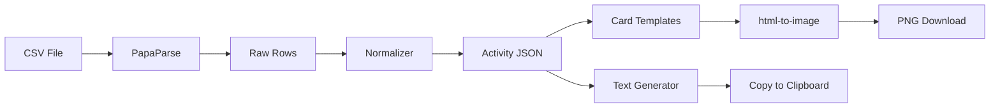

# RunShare — Running Activity Share Generator (MVP v0.1)

Build a web app to upload CSV running activity data, parse interval splits, and generate transparent PNG share cards + copyable text summaries.

## User Review Required

> [!IMPORTANT]
> **Frontend-Only Architecture**: For MVP v0.1, this plan implements everything client-side (no backend/database). CSV parsing, data normalization, card rendering, and PNG export all happen in the browser. This keeps the MVP fast to build and deploy. Backend (FastAPI + PostgreSQL) can be added in v0.2+ when screenshot OCR and user accounts are needed.

> [!IMPORTANT]
> **No Tailwind CSS**: Per workspace conventions, we'll use vanilla CSS with a custom design system (CSS custom properties). The plan document mentions Tailwind, but we'll achieve the same premium look with vanilla CSS and avoid the extra dependency.

> [!WARNING]
> **No Login / No Persistence**: MVP v0.1 has no user accounts, no database, and no saved history. Everything is session-based. Users upload → preview → export → done.

## Open Questions

1. **CSV Format**: The plan references Garmin-style CSV exports (with `Step Type`, `Interval` columns). Should we also support generic CSV formats (e.g., just columns for distance, time, pace) or strictly target Garmin Connect exports for MVP?
2. **Card Dimensions**: The plan mentions 1080×1920 (Story) and 1080×1080 (Square). Should we default to Story size, or let the user pick before export?
3. **Font Choice**: Any preference on the card typography? I'm planning to use **Inter** (clean, modern) for the UI and **JetBrains Mono / Space Mono** for the card numbers to give a sporty/data feel.
4. **Color Scheme**: Planning a dark-mode-first design with accent colors (electric blue / neon green gradient). Any preference?

---

## Proposed Changes

### Technology Stack

| Layer | Choice | Rationale |
|-------|--------|-----------|
| Framework | React 19 + Vite | Fast dev server, modern defaults |
| Language | JavaScript (no TS for speed) | Faster MVP, can migrate later |
| Styling | Vanilla CSS + CSS Custom Properties | Full control, no extra deps |
| CSV Parser | `papaparse` | Industry standard, web worker support |
| PNG Export | `html-to-image` | Client-side DOM→PNG with transparency |
| File Upload | Native `<input type="file">` + drag-and-drop | No extra library needed |
| Icons | `lucide-react` | Clean, consistent icon set |
| Fonts | Google Fonts (Inter + Space Mono) | Modern typography |

---

### Project Structure

```
runshare/
├── index.html
├── package.json
├── vite.config.js
├── public/
│   └── favicon.svg
├── src/
│   ├── main.jsx                    # Entry point
│   ├── App.jsx                     # Main app layout + state
│   ├── index.css                   # Global styles + design tokens
│   │
│   ├── components/
│   │   ├── ui/                     # Reusable UI primitives
│   │   │   ├── Button.jsx
│   │   │   ├── Button.css
│   │   │   ├── FileDropzone.jsx
│   │   │   ├── FileDropzone.css
│   │   │   ├── CopyButton.jsx
│   │   │   └── CopyButton.css
│   │   │
│   │   ├── layout/
│   │   │   ├── Header.jsx
│   │   │   ├── Header.css
│   │   │   ├── Stepper.jsx         # Step indicator (Upload → Preview → Export)
│   │   │   └── Stepper.css
│   │   │
│   │   ├── upload/
│   │   │   ├── UploadStep.jsx      # CSV upload + drag-and-drop
│   │   │   └── UploadStep.css
│   │   │
│   │   ├── preview/
│   │   │   ├── PreviewStep.jsx     # Parsed data review + edit
│   │   │   ├── PreviewStep.css
│   │   │   ├── ActivitySummary.jsx # Summary stats display
│   │   │   ├── SegmentTable.jsx    # Editable segment/rep table
│   │   │   └── SegmentTable.css
│   │   │
│   │   ├── export/
│   │   │   ├── ExportStep.jsx      # Template selection + export
│   │   │   ├── ExportStep.css
│   │   │   ├── TemplateSelector.jsx
│   │   │   ├── TemplateSelector.css
│   │   │   ├── CardPreview.jsx     # Live card preview container
│   │   │   ├── CardPreview.css
│   │   │   ├── TextPreview.jsx     # Copyable text output
│   │   │   ├── TextPreview.css
│   │   │   ├── ExportControls.jsx  # Size picker + download button
│   │   │   └── ExportControls.css
│   │   │
│   │   └── templates/              # Share card templates (rendered to PNG)
│   │       ├── MinimalOverlay.jsx
│   │       ├── MinimalOverlay.css
│   │       ├── IntervalBreakdown.jsx
│   │       ├── IntervalBreakdown.css
│   │       ├── ClassicSummary.jsx
│   │       └── ClassicSummary.css
│   │
│   ├── lib/
│   │   ├── csvParser.js            # PapaParse wrapper + Garmin mapping
│   │   ├── normalizer.js           # Raw CSV → normalized Activity JSON
│   │   ├── textGenerator.js        # Activity JSON → copyable text styles
│   │   ├── exportImage.js          # html-to-image wrapper for PNG export
│   │   └── formatUtils.js          # Pace, time, distance formatting helpers
│   │
│   └── hooks/
│       ├── useActivity.js          # Activity state management
│       └── useExport.js            # Export logic (size, format)
```

---

### Data Flow



---

### Normalized Activity JSON Schema

This is the internal data format that all inputs normalize to, and all outputs consume from:

```json
{
  "activityType": "interval_run",
  "summary": {
    "distanceKm": 8.0,
    "duration": "1:01:19",
    "avgPace": "7:40",
    "avgHr": 141,
    "maxHr": 181,
    "calories": 552,
    "elevationGain": null
  },
  "segments": [
    {
      "type": "warmup",
      "label": "Warm Up",
      "distanceKm": 1.03,
      "duration": "7:17.2",
      "avgPace": "7:04",
      "avgHr": 130,
      "maxHr": 145
    },
    {
      "type": "interval",
      "rep": 1,
      "distanceKm": 0.5,
      "duration": "2:39.2",
      "avgPace": "5:18",
      "avgHr": 165,
      "maxHr": 175
    },
    {
      "type": "rest",
      "rep": 1,
      "duration": "2:30",
      "avgPace": "11:36"
    },
    {
      "type": "cooldown",
      "label": "Cool Down",
      "distanceKm": 3.66,
      "duration": "30:35.0",
      "avgPace": "8:21",
      "avgHr": 125,
      "maxHr": 135
    }
  ],
  "intervalSummary": {
    "repCount": 5,
    "repDistanceKm": 0.5,
    "fastestRep": { "rep": 5, "avgPace": "4:26" },
    "slowestRep": { "rep": 3, "avgPace": "5:47" },
    "avgRepPace": "5:22"
  }
}
```

---

### Component Details

#### Phase 1: Foundation & CSV Parser

##### [NEW] `package.json`, `vite.config.js`, `index.html`
- Initialize project with `npm create vite@latest ./ -- --template react`
- Install deps: `papaparse`, `html-to-image`, `lucide-react`

##### [NEW] `src/index.css` — Design System
- CSS custom properties for colors, spacing, typography, shadows
- Dark mode palette: deep navy background (`#0a0e1a`), glass panels with `backdrop-filter: blur`
- Accent gradient: electric blue → cyan (`#3b82f6` → `#06b6d4`)
- Typography scale, border-radius tokens, transition tokens
- Utility classes for layout

##### [NEW] `src/lib/csvParser.js`
- Wraps PapaParse with `header: true` config
- Maps Garmin CSV columns → internal field names
- Auto-detects column names (case-insensitive fuzzy match)
- Returns `{ rows, headers, errors }`

##### [NEW] `src/lib/normalizer.js`
- Takes parsed CSV rows → produces Activity JSON
- Logic for `Step Type` mapping:
  - `"Warm Up"` → `warmup` segment
  - `"Run"` → `interval` segment (auto-numbered)
  - `"Rest"` / `"Recover"` → `rest` segment
  - `"Cool Down"` → `cooldown` segment
  - `Interval === "Summary"` → activity summary
- Computes `intervalSummary` (rep count, fastest/slowest, avg pace)
- Auto-detects activity type: if intervals found → `interval_run`, else `run`

##### [NEW] `src/lib/formatUtils.js`
- `formatPace(paceString)` — normalize pace display
- `formatDuration(durationString)` — normalize time display
- `formatDistance(km)` — format with appropriate decimal places
- `parsePaceToSeconds(paceString)` — for comparison/sorting
- `secondsToPace(seconds)` — reverse conversion

---

#### Phase 2: Upload & Preview UI

##### [NEW] `src/components/upload/UploadStep.jsx`
- Large drag-and-drop zone with animated border
- File type validation (`.csv` only)
- Sample CSV download link (with example data)
- Upload state: idle → uploading → parsing → done/error
- Animated file icon that transforms on drag-over

##### [NEW] `src/components/preview/PreviewStep.jsx`
- Display parsed activity summary (distance, time, pace, HR)
- Editable segment table with inline editing
- Color-coded segment types (warmup=yellow, interval=green, rest=gray, cooldown=blue)
- "Looks good" / "Re-upload" action buttons
- Validation warnings (e.g., "No intervals detected")

##### [NEW] `src/components/preview/SegmentTable.jsx`
- Rows for each segment with type badge, distance, time, pace
- Interval reps highlighted with rep numbers
- Fastest rep auto-highlighted with a crown/star icon
- Editable cells (click to edit pace, time, distance)

---

#### Phase 3: Share Card Templates

##### [NEW] `src/components/templates/MinimalOverlay.jsx`
- Large distance number, duration, pace
- Ultra-clean layout, transparent background
- Designed for overlaying on photos
- Monospace numbers, thin dividers

##### [NEW] `src/components/templates/IntervalBreakdown.jsx`
- **Strava-style horizontal bar chart layout** (reference: `example_format/split.jpeg`)
- Dark background card with bold "Splits" title
- Column headers: Km | Pace | [bar graph] | Elev | HR
- Each row shows:
  - Rep/km number (left-aligned)
  - Pace value (e.g., "6:53")
  - **Horizontal bar** — width proportional to pace (faster = longer bar)
  - Elevation delta (e.g., "-5", "+3")
  - Heart rate (e.g., "143")
- Bar color: **Strava orange (`#FC4C02`)** instead of the blue in the reference
- Fastest rep row highlighted with a subtle orange glow/brighter bar
- Thin separator line below the header row
- Optional warm up / cool down rows with distinct styling
- Clean monospace numbers for data alignment

##### [NEW] `src/components/templates/ClassicSummary.jsx`
- Standard activity card: distance, time, pace, HR, calories
- Grid layout with labeled stats
- Optional elevation display
- Clean, Strava-inspired but more customizable

---

#### Phase 4: Text Generator & Export

##### [NEW] `src/lib/textGenerator.js`
- Three output styles from Activity JSON:
  1. **Clean**: One-liner summary
  2. **Coach Mode**: Detailed rep analysis with avg/fastest/slowest
  3. **Social Caption**: Narrative-style text for social media
- Each returns a plain string ready for clipboard

##### [NEW] `src/lib/exportImage.js`
- Wraps `html-to-image` `toPng()` 
- Accepts a DOM ref, target dimensions (1080×1920, 1080×1080, custom)
- Scales the card template to fit target dimensions
- Triggers browser download with generated filename
- Handles transparent background correctly

##### [NEW] `src/components/export/ExportStep.jsx`
- Split layout: left = card preview, right = text preview + controls
- Template selector (3 cards as clickable thumbnails)
- Size selector (Story / Square / Custom)
- Text style selector (Clean / Coach / Social)
- Copy text button with success animation
- Download PNG button with loading state

---

#### Phase 5: App Shell & Polish

##### [NEW] `src/App.jsx`
- 3-step wizard flow: Upload → Preview → Export
- Step state management
- Activity data flows down via props
- Animated step transitions

##### [NEW] `src/components/layout/Header.jsx`
- App logo/name ("RunShare")
- Tagline: "Share your runs, your way"
- Minimal, stays out of the way

##### [NEW] `src/components/layout/Stepper.jsx`
- Horizontal step indicator with animated progress
- Steps: "Upload" → "Review" → "Export"
- Connected dots with progress line

---

### UI Design Direction

| Aspect | Design Choice |
|--------|---------------|
| **Mode** | Dark mode (deep navy `#0a0e1a`) |
| **Panels** | Glassmorphism — semi-transparent cards with blur |
| **Accents** | Electric blue → cyan gradient |
| **Typography** | Inter (UI), Space Mono (numbers on cards) |
| **Animations** | Smooth step transitions, hover micro-animations, pulse on drag-over |
| **Cards** | Rounded corners (16px), subtle border glow |
| **Buttons** | Gradient fill with hover lift effect |
| **Upload Zone** | Dashed animated border, icon animation |

---

## Verification Plan

### Automated Tests

1. **CSV Parsing**: Test with sample Garmin CSV files
   - Verify correct column detection
   - Verify segment type mapping (warmup, interval, rest, cooldown)
   - Verify summary extraction
   
2. **Normalizer**: Test Activity JSON output
   - Verify interval summary computation (fastest rep, avg pace)
   - Verify edge cases (no warmup, no cooldown, single rep)

3. **Text Generator**: Test all 3 text styles output correct format

4. **Build Verification**: `npm run build` succeeds without errors

### Manual Verification

1. **Browser Testing**: Open dev server, walk through full flow:
   - Upload sample CSV → verify parsed data → select template → preview card → download PNG → copy text
   
2. **PNG Export**: Verify downloaded PNG:
   - Has transparent background (open in image viewer)
   - Correct dimensions (1080×1920 for Story)
   - Text is crisp and readable
   
3. **Copy Text**: Verify clipboard content matches expected format

4. **Responsive**: Verify layout works on different screen widths

5. **Visual QA**: Take screenshots of each step for review
